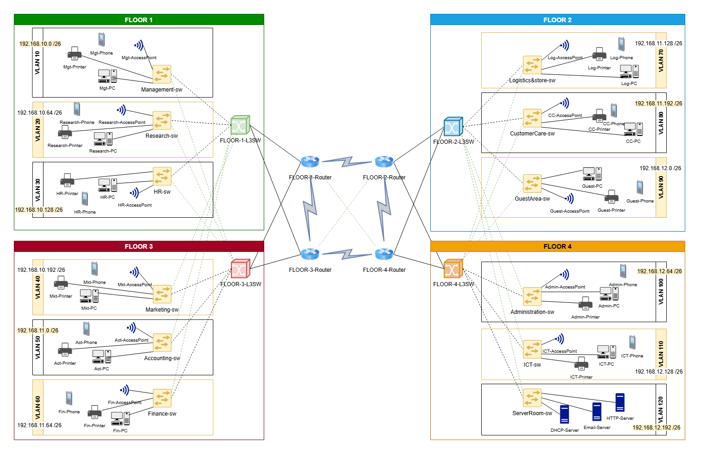

# Bank Network Infrastructure Simulation (Cisco Packet Tracer)

## Topology Diagram

---

## Project Overview

This project simulates the network infrastructure of a multi-floor bank environment using *Cisco Packet Tracer*. The topology is designed to reflect a realistic enterprise banking network with segmented departments, centralized services, secure management access, dynamic routing, and wireless connectivity.

The network was built to support:

- VLAN segmentation
- Inter-VLAN routing through Layer 3 switches
- Dynamic routing using OSPF
- DHCP, DNS, HTTP, and Email services
- SSH remote device management
- Port security on access ports
- Wireless connectivity through access points

---

# Network Architecture

The topology consists of:

- 4 routers
- 4 Layer 3 switches
- Multiple access switches
- Wireless access points
- A server room hosting core network services
- 12 VLANs distributed across different floors/departments

Each floor uses a **Layer 3 switch** for inter-VLAN routing, while routers and Layer 3 switches exchange routes dynamically using **OSPF**.

---

# VLAN Structure

## Floor 1

- VLAN10 — 192.168.10.0/26 
- VLAN20 — 192.168.10.64/26 
- VLAN30 — 192.168.10.128/26 

## Floor 3

- VLAN40 — 192.168.10.192/26
- VLAN50 — 192.168.11.0/26
- VLAN60 — 192.168.11.64/26

## Floor 2

- VLAN70 — 192.168.11.128/26
- VLAN80 — 192.168.11.192/26
- VLAN90 — 192.168.12.0/26

## Floor 4

- VLAN100 — 192.168.12.64/26
- VLAN110 — 192.168.12.128/26
- VLAN120 — 192.168.12.192/26

Each VLAN has its own SVI configured on the Layer 3 switch and serves as the default gateway for hosts in that subnet.

---

# Core Configurations Implemented

## 1. Basic Device Hardening and Management

All routers, Layer 3 switches, and access switches were configured with:

- Hostnames
- MOTD banners
- Console password protection 
- Encrypted privileged EXEC password 
- Local user account for management access 
- Password encryption
- Disabled DNS lookup for mistyped commands
- Domain name configuration: *bank.local*
- RSA key generation for SSH
- VTY lines restricted to **SSH access only**

---

## 2. VLAN Segmentation and Access Layer Configuration

Each access switch was configured with:

- Trunk links toward upstream devices
- VLAN creation and naming
- Access port assignment per VLAN
- **PortFast** on end-device interfaces
- **BPDU Guard** on access ports
- **Port Security using sticky MAC addresses**
- Maximum of **2 MAC addresses per secured port**
- Violation mode set to **shutdown**

### Note on Wireless Ports
Port security was intentionally **not enabled on switch ports connected to access points**, allowing multiple wireless users to connect without causing the port to shut down.

---

## 3. Inter-VLAN Routing

Each Layer 3 switch was configured to perform **inter-VLAN routing** using:

- ip routing
- VLAN interface creation
- IP addressing on SVIs
- *ip helper-address* on user VLANs to forward DHCP requests to the DHCP server

---

## 4. Dynamic Routing with OSPF

Routers and Layer 3 switches were configured with **OSPF process 10** to advertise all connected routed networks.

OSPF was used to provide:

- Automatic route exchange
- Faster and more efficient route management than static routing

---

## 5. Centralized Network Services

Servers in the server room were configured with **static IP addresses** and provided the following services:

### DHCP

A DHCP server was configured with address pools for client VLANs so end devices could receive IP configuration automatically.

### DNS

A DNS server was configured to resolve internal service names within the network.

### HTTP

A web server was configured and its website content was customized. A DNS record was also added so users could access the site by name.

### Email

An email server was configured so devices in the network could send and receive emails successfully.

---

## 6. Wireless Connectivity

Each access point was configured with:

- A wireless network name (SSID)
- A password for secured wireless access

---

# Security Features

This project includes several foundational security measures:

- SSH-only remote management
- Encrypted passwords
- Local login authentication
- Port security with sticky MAC learning
- BPDU Guard on access ports
- Segmentation through VLANs

---

# Troubleshooting and OSPF Issue Resolution

During the project, an OSPF issue affected end-to-end connectivity.

## Problem Observed

- Floors **1 and 3** could communicate
- Floors **2 and 4** could communicate
- But communication **between these two groups failed**

## Cause

The issue was related to OSPF behavior, specifically to the automatic router ID selection.

## Solution 

I resolved the issue by:

- assigning unique OSPF router IDs
- configuring passive interfaces for VLAN networks
- allowing OSPF neighbor relationships only on transit/routed links

---

# Skills Demonstrated

This project demonstrates practical knowledge of:

- VLAN creation and segmentation
- Inter-VLAN routing on Layer 3 switches
- OSPF dynamic routing
- DHCP relay using *ip helper-address*
- Secure switch access configuration with SSH
- Port security and Layer-2 protection features
- Server configuration for DHCP, DNS, HTTP, and Email
- Wireless integration in enterprise networks
- Network troubleshooting and routing issue resolution
- Cisco IOS CLI configuration

---

# Tools Used

- Cisco Packet Tracer
- Cisco IOS CLI

